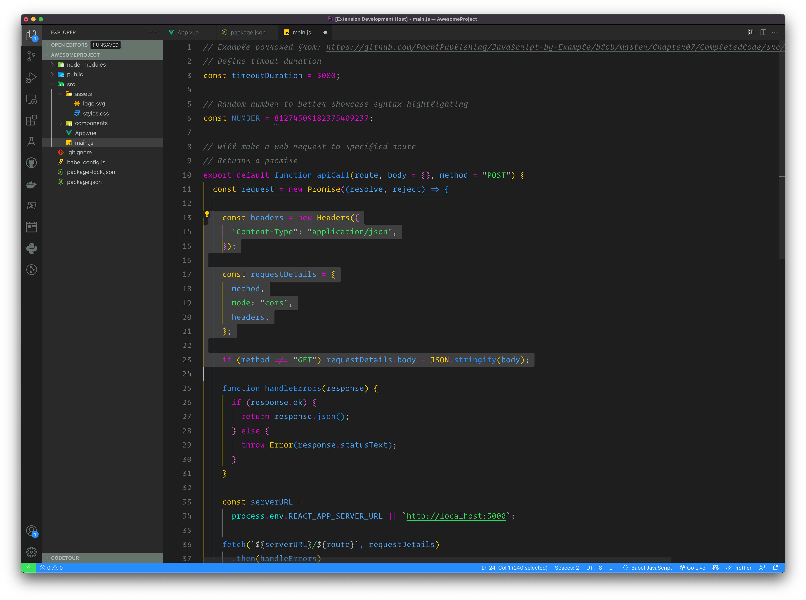
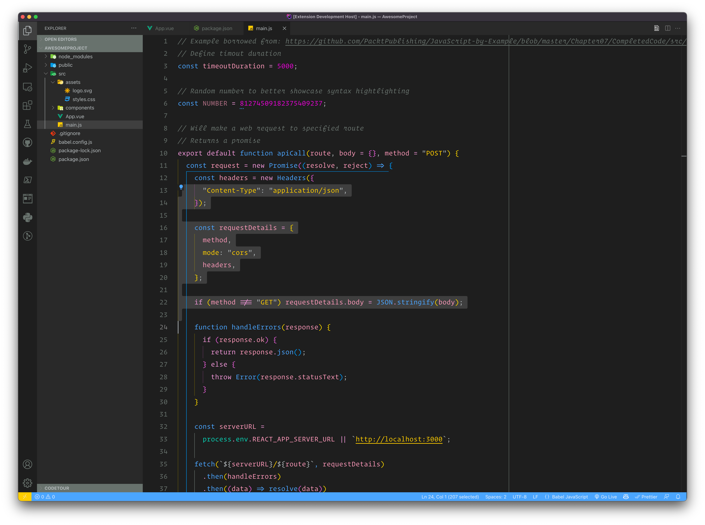
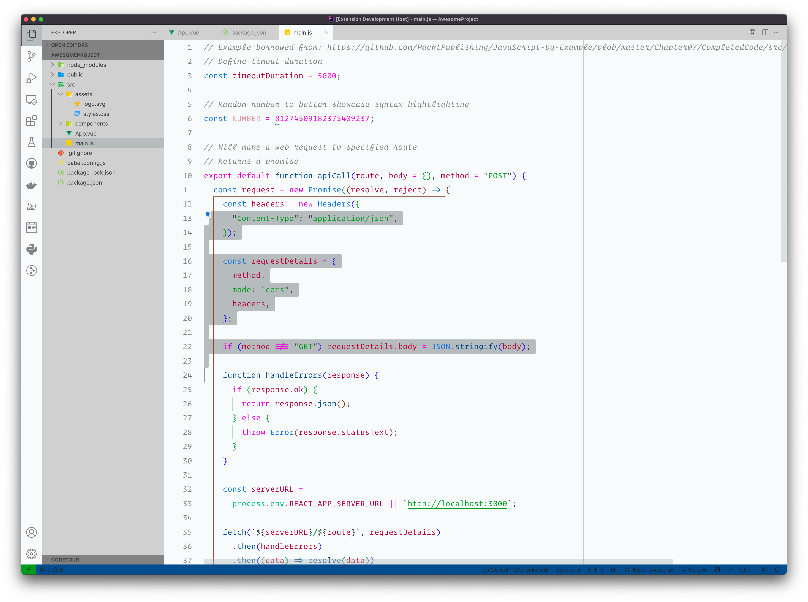

# Remix VS Code Themes

These themes use the colors from the [Remix Run website](https://remix.run) as
well as the [Remix Run Document site](https://docs.remix.run).

## Remix Run website (Dark)

## Remix Run Document site (Dark)

## Remix Run Document site (Light)

VS Code themes generated using [`base16-builder-typescript`](https://github.com/golf1052/base16-builder-typescript)
